<!-- Generated by web/tutorial_pages.py --write-readme from docs/tutorials/topics.json. Edit the registry, not this file. -->
<!-- SPDX-License-Identifier: GPL-3.0-only -->
# Caravel tutorials

<a href="https://bonszaimusic.github.io/caravel/tutorials/">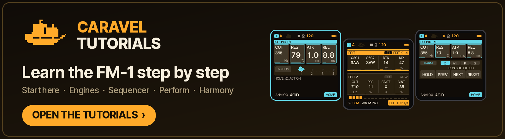</a>

**[Open the tutorials on the Caravel site](https://bonszaimusic.github.io/caravel/tutorials/)** for the illustrated version with a map of all lessons, or read them here. Firmware screenshots use the actual renderer; clearly labelled concept diagrams and FM-1 figures are illustrations. Sound examples are native DSP renders, not device recordings: [listen](https://bonszaimusic.github.io/caravel/sounds/).

### Start

New to the FM-1 or to Caravel? Begin here.

| | | |
| --- | --- | --- |
| 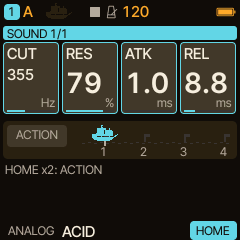 | **[1 Start here](start-here.md)** · about 10 min | Back up, install, make a first sound and sequence, save it, and know the way back to the stock firmware. |
| 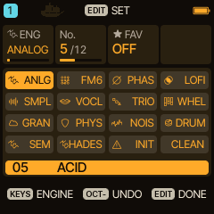 | **[2 Basics](basics.md)** · about 10 min | Tracks, engine versus preset, the pages and how to move between them, saving projects and presets. |

### Engines

Four engines, each with what to do first, then how the sound is made.

| | | |
| --- | --- | --- |
| 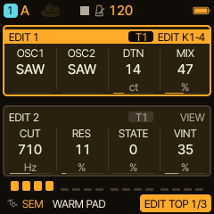 | **[3.1 SEM](engine-sem.md)** · about 10 min | Warm pads, brass, strings and notch sweeps. |
| 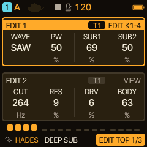 | **[3.2 HADES](engine-hades.md)** · about 10 min | Basses, sub layers and dark leads. |
| 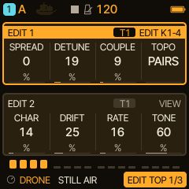 | **[3.3 DRONE](engine-drone.md)** · about 10 min | Evolving drones, beds, bells and slow textures (experimental). [Watch: DRONE engine demo (YouTube)](https://www.youtube.com/watch?v=N08Vx3x7fLE) |
| 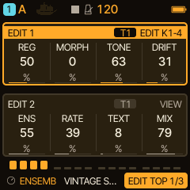 | **[3.4 ENSEMBLE](engine-ensemble.md)** · about 10 min | Strings, choirs and dark pads with a built-in three-tap ensemble, in stereo. |

### Play and perform

Sequence, arpeggiate, perform and follow a chord progression.

| | | |
| --- | --- | --- |
| 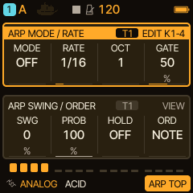 | **[4 Sequencer and arpeggiator](seq-arp.md)** · about 12 min | Step entry, timing, recording while it plays, parts A to D, and the arpeggiator. |
| 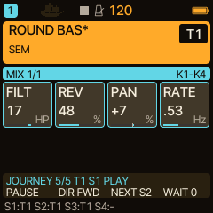 | **[5 HOME performance functions](home-performance.md)** · about 15 min | The ACTION banks: Random Morph and Journey, STASIS hold, Pair Morph and macros. [Random Morph and Journey](https://bonszaimusic.github.io/caravel/tutorials/random-morph-journey/) [STASIS: HOLD, ADD and BLEND](https://bonszaimusic.github.io/caravel/tutorials/stasis/) [Pair Morph, macros and saving](home-and-stasis.md) [Download the STASIS performance setup](https://bonszaimusic.github.io/caravel/performance/) |
| 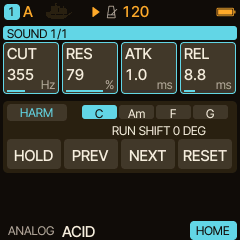 | **[6 HARMONY](harmony-live.md)** · about 15 min | Set up a chord progression, let tracks follow it, and steer it live from the HARM bank; LATCH. |
| 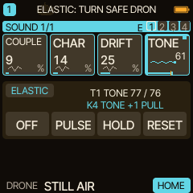 | **[6.1 ELASTIC · First steps](elastic-first-steps.md)** · about 10 min | Make one HOME control breathe, bounce and return using the ELASTIC action bank. |
| 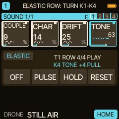 | **[6.2 ELASTIC · Linked springs](elastic-linked-springs.md)** · about 12 min | Connect four ROW springs with COUPLE and a reproducible SEED network. |
| 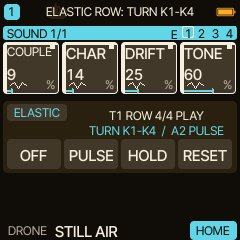 | **[6.3 ELASTIC · Ambient recipes](elastic-ambient-recipes.md)** · about 12 min | Three starting recipes for breathing drones, moving textures and two-track tides. |

### Shape and connect

Filter, effects, modulation, and the outside world.

| | | |
| --- | --- | --- |
| 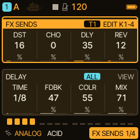 | **[7 Filter, FX and modulation](filter-fx.md)** · about 12 min | The per-track filter, reverb, delay and insert effects, LFO and envelope. |
| 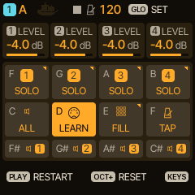 | **[8 MIDI and sync](midi-sync.md)** · about 8 min | MIDI Learn, clock and start over USB and TRS. |

### Help

When something does not work, and the way back.

| | | |
| --- | --- | --- |
| 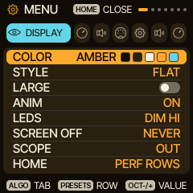 | **[9 Help](help.md)** · about 5 min | The FAQ, backup, update and the way back, and the known limits. [Troubleshooting & FAQ](../../docs/faq.md) |

### Earlier tutorials

[HOME, Pair Morph, macros, saving and STASIS (0.5.0 and 0.6.0)](home-and-stasis.md) · [Random Morph and Morph Journey](random-morph-journey.md) · [Live Harmony and the HOME ACTION key map](harmony-live.md) · [0.5.0 PDF quickstart](Caravel-0.5.0-Quickstart.pdf) · [0.6.0 STASIS PDF guide](Caravel-0.6.0-STASIS-Guide.pdf)

Back to the [README](../../README.md).
